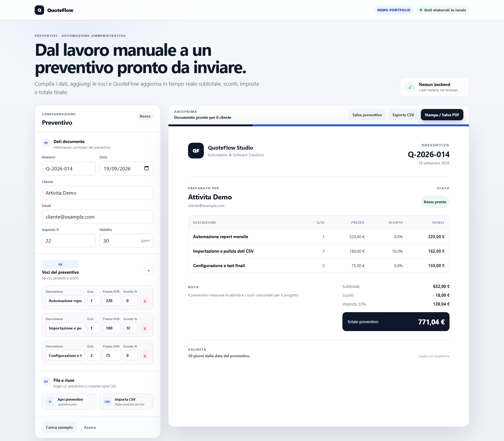

# QuoteFlow

Demo portfolio per creare, salvare, riaprire ed esportare preventivi professionali direttamente dal browser.

**Demo online:** https://ago993.github.io/quoteflow-demo/

## Funzioni

- dati preventivo e cliente;
- righe prodotto/servizio modificabili;
- quantita e prezzo unitario;
- sconto percentuale per riga;
- imposta configurabile;
- calcolo automatico di subtotale, imposta e totale;
- importazione CSV di righe prodotto/servizio;
- esportazione CSV reimportabile;
- salvataggio completo in `.qflow`;
- riapertura di un preventivo salvato con ricostruzione dello stato;
- stampa / salvataggio PDF tramite browser.

## Round-trip

Il file `.qflow` conserva numero, data, cliente, email, imposta, validita e tutte le righe. Puo essere riaperto in QuoteFlow per continuare a modificare il preventivo. I vecchi file `.quoteflow.json` restano compatibili.

Il CSV e pensato invece per interoperabilita con Excel e altri strumenti tabellari. QuoteFlow riconosce separatori con virgola, punto e virgola o tab.

## Privacy

L'elaborazione avviene interamente nel browser. La demo non invia dati a un backend.

## Test

```bash
node tests/test_core.js
```

I test coprono anche export/import CSV e salvataggio/riapertura completa del preventivo.

## Avvio locale

```bash
python -m http.server 8020
```

Poi apri `http://localhost:8020/?demo=1`.

## Stack

HTML, CSS e JavaScript puro. Nessuna dipendenza runtime.

## Nota

Questa e una demo dimostrativa. In un progetto reale campi, imposte, numerazione, layout, regole di sconto e integrazioni verrebbero adattati alle esigenze del cliente.


